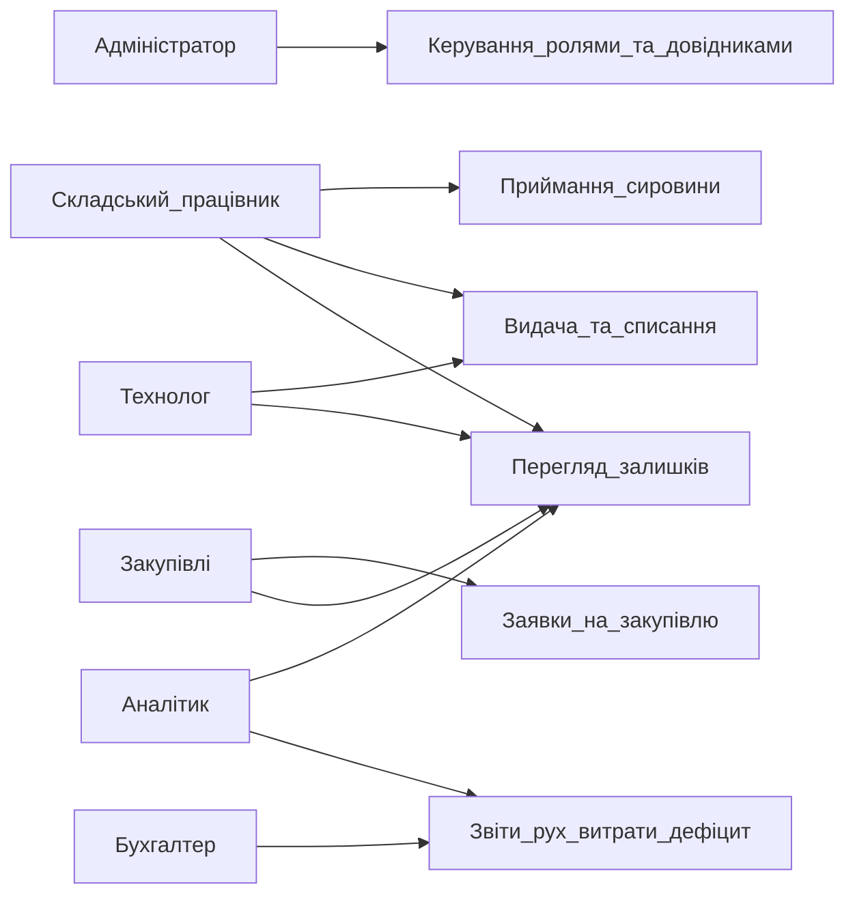

# Use Case Diagram

Огляд основних use case системи обліку сировини на виробництві.

## Ролі

| Користувач | Опис |
|-------|------|
| Адміністратор | Керує користувачами, ролями, довідниками матеріалів і складами |
| Складський працівник | Реєструє надходження, видачу, коригує залишки |
| Закупівлі | Створює заявки на закупівлю та контролює поставки |
| Технолог виробництва | Списує / запитує сировину під виробничі партії |
| Бухгалтер | Переглядає звіти для вартісного обліку та звірки |
| Аналітик | Аналізує залишки, витрати та дефіцит |

## Діаграма (use case overview)

## Відповідність вимогам

| Use case | Вимоги |
|----------|--------|
| Керування ролями та довідниками | FR-05 |
| Приймання сировини | FR-01 |
| Видача та списання | FR-02 |
| Перегляд залишків | FR-03 |
| Заявки на закупівлю | FR-05 (роль Закупівлі) |
| Звіти: рух, витрати, дефіцит | FR-04 |
